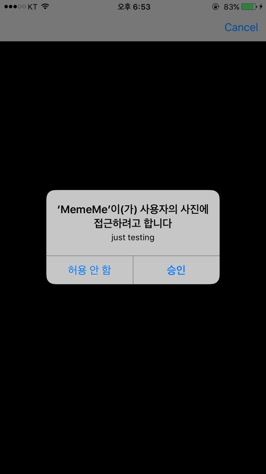
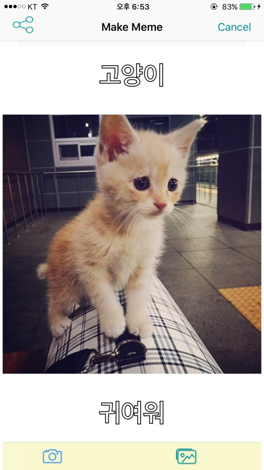
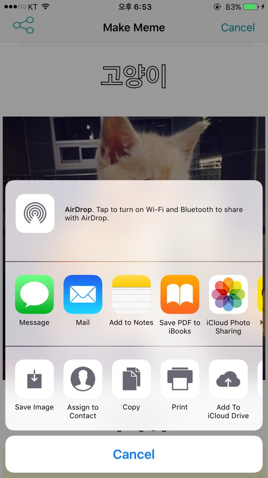
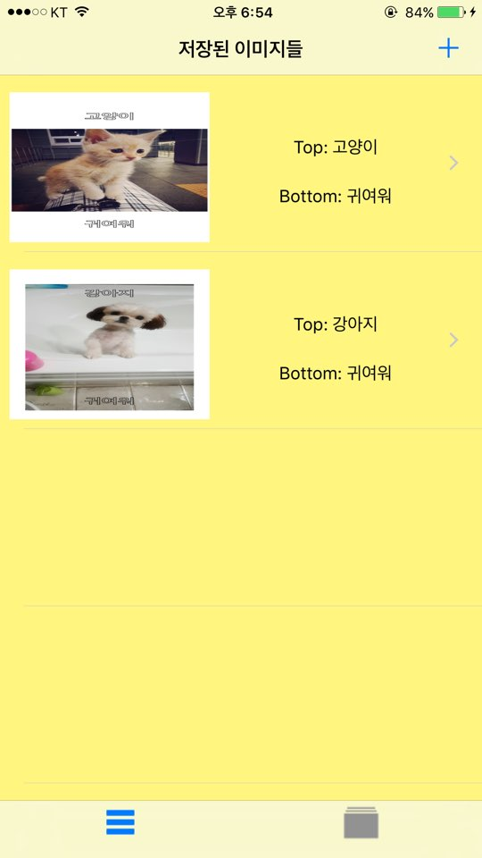
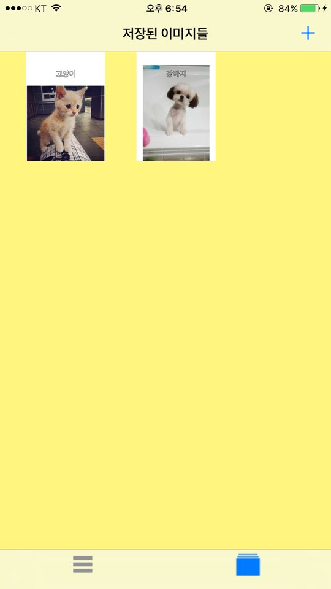
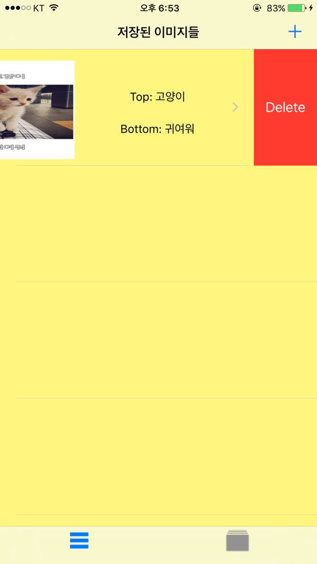

MemeMe  App
==================

**MemeMe by Zedd**
-------------

**MemeMe 앱 소개!**

> **Note:**

> -  카메라로 촬영하거나,  자신의 사진앨범에서 사진을 가져와 Top, Bottom
> 에 원하는 글씨를 넣을 수 있다. 
> - 사용자가 만든 사진은 공유기능을 통해 친구들과 공유하거나 사용자 사진앨범에 저장 할 수 있으며, 바로 App내의 테이블뷰와 콜렉션뷰에 올라가게 된다.
> - 테이블뷰에 올라간 사진은  사용자가 적은 Top,Bottom글씨를 볼 수 있다. 
> - 테이블뷰나 콜렉션뷰에 저장된 사진을 누르면 사진을 크게 볼 수 있다. 

> -

**kick**
--------

> - 테이블 뷰에서 swipe하여 원하는 사진을 삭제 할 수 있다. 그냥 테이블 뷰에서만 삭제하는 것이 아닌 UIApplication.shared.delegate를 통해 사진을 삭제하는 것이므로 테이블 뷰에서 지우고 콜렉션뷰를 가도 사진은 없어져 있게 된다. 

**스크린샷**
---

> 사진이나 앨범에 접근시 먼저 사용자의 Permission을 얻게됩니다.

> 위 아래에 사용자가 원하는 글씨를 넣을 수 있습니다.  

> 공유버튼을 눌렀을 시 나오는 화면을 통해 앨범에 저장 및 공유가 가능합니다. 

> 저장된 사진은 MemeMe앱의 테이블뷰와 콜렉션뷰에 저장되게 됩니다. 

> 테이블뷰에서 스와이프를 통해 저장한 사진을 삭제할 수 있습니다. shared 배열에 있는 이미지 자체를 지움으로서, 테이블뷰에서만 사라지는 것이 아닌 콜렉션뷰에서도 사라지게 됩니다. 

**시연 동영상**
==========

[시연 동영상은 유투브에서 확인 하실 수 있습니다.](https://youtu.be/VS6jJJBBWEo)

